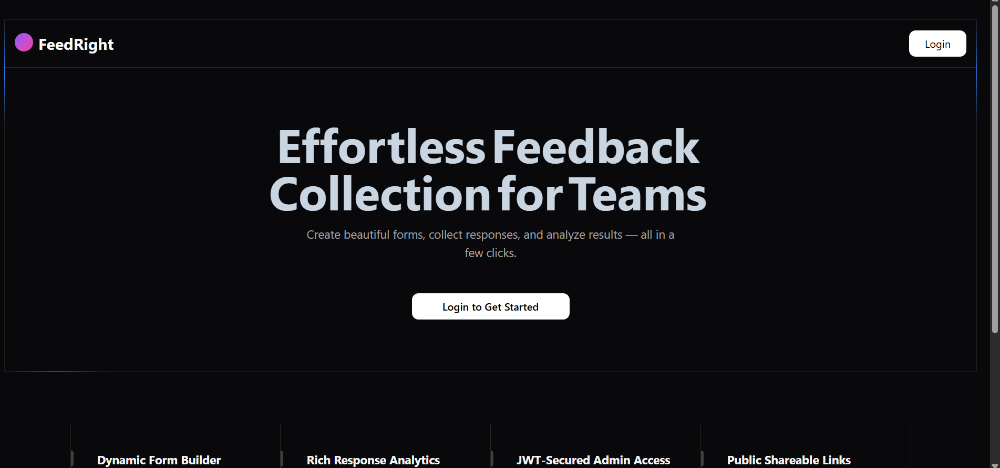

# FeedRight – Smarter Feedback Collection

## Project Description

FeedRight is a modern **feedback collection platform** built for simplicity, customization, and clarity. It empowers businesses and teams to create feedback forms, collect insights, and analyze responses—all in one streamlined dashboard.

<p align="center"> 
  
</p>


## Key Features

- **Custom Feedback Forms** – Create dynamic forms with 3–5 tailored questions.
- **JWT-Based Auth** – Secure login and access control for admins.
- **Public Form Links** – Easily shareable URLs for customer feedback.
- **CSV Export** – Download responses for offline analysis.
- **Thank You Pages** – Personalized messages after form submission.

## Tech Stack

- **Backend:** Node.js + Express
- **Database:** MongoDB
- **Frontend:** React.js + Tailwind + shadcn/ui
- **AI:** Generative AI (GeminiAI-based) for risk reporting & scenario analysis
- **Auth:** JWT / Sessions
- **Visualisation:** Recharts / Chart.js
- **Version Control:** GitHub

## Project Structure

```
FeedRight/
├── server/
│   ├── config/           # MongoDB setup
│   ├── controllers/      # Route logic
│   ├── helpers/          # Utility functions
│   ├── middlewares/      # Auth, Error handlers, etc.
│   ├── models/           # Mongoose Schemas
│   ├── routes/           # Express routes
│   └── index.js          # Backend entry point
│
├── client/
│   ├── src/
│   │   ├── components/   # UI Components (Charts, Layouts, Cards)
│   │   ├── pages/        # Pages like Login, Dashboard, Form, Responses
│   │   ├── context/      # Global state (User, Auth)
│   │   ├── hooks/        # Custom React hooks
│   │   ├── lib/          # Utility functions
│   │   ├── App.js        # Route handling
│   │   └── main.jsx      # App mount point
│
└── README.md

```

## Installation

### Prerequisites

- Node.js & npm
- MongoDB installed or use MongoDB Atlas

### Local Development
```bash
# Clone the repo
git clone https://github.com/insane-22/feedright.git
cd feedright

# Install server dependencies
cd server
npm install

# Setup env variiables
cp .env.example .env

# Start backend
npx nodemon index.js

# In a new terminal, install frontend
cd ../client
npm install

# Setup env variiables
cp .env.example .env

# Start frontend
npm run dev

```


After this, you can access the server at http://localhoost:3000 and client application at http://localhost:5173